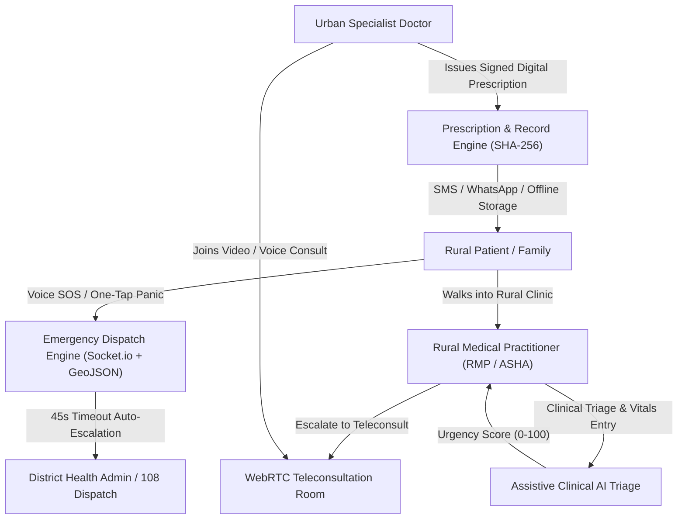
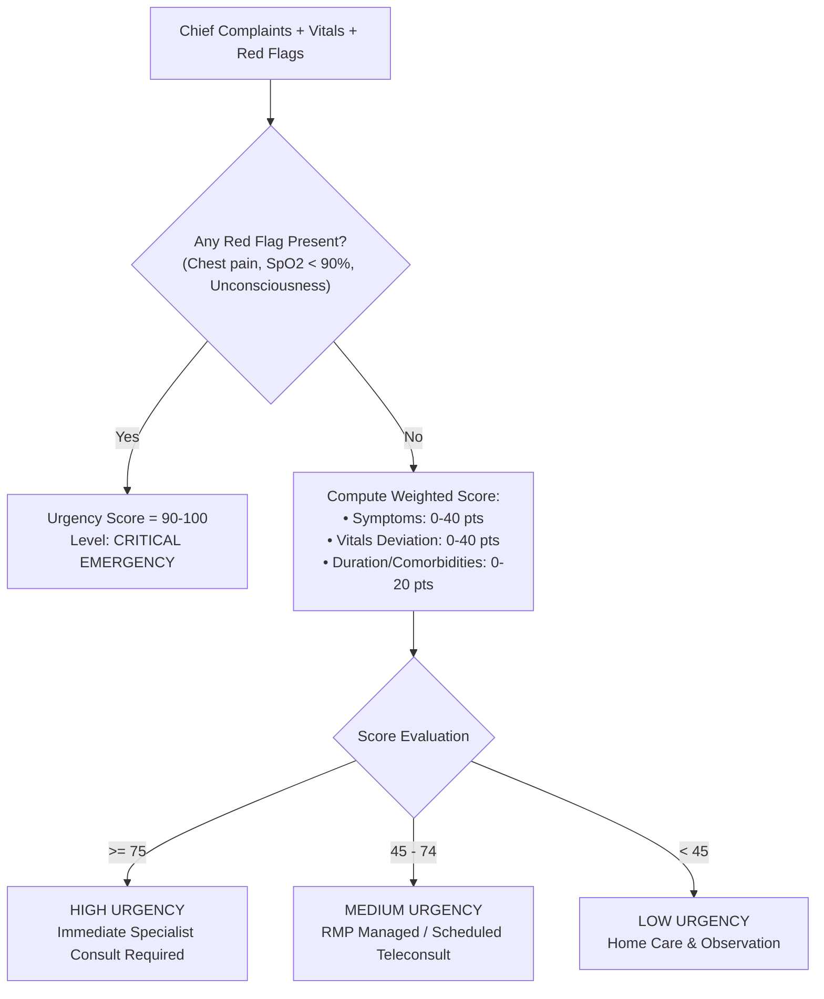
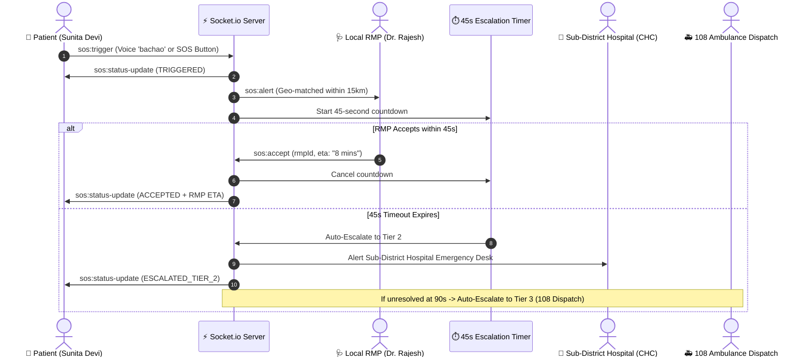
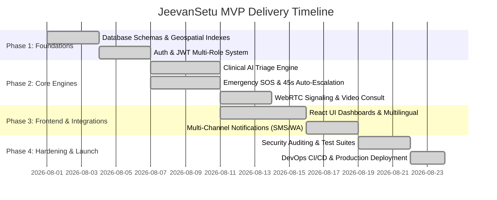

# 🏥 JeevanSetu (जीवनसेतु) — Master MVP Architecture & Execution Plan

> **Bridging the Rural-to-Specialist Telemedicine & Emergency Dispatch Gap in India**

---

## 1. 🎯 Project Overview & Vision

**JeevanSetu (जीवनसेतु)** is an ultra-resilient, rural-first healthcare teleconsultation and emergency response platform designed specifically for rural and semi-urban Indian populations.

### Core Problems Addressed:
1. **Critical Doctor-to-Patient Deficit**: Rural India suffers from severe shortages of medical specialists (cardiology, neurology, pediatrics, OB/GYN).
2. **Emergency Response Delays**: Medical emergencies (trauma, cardiac arrests, snakebites, severe maternal distress) in remote villages often experience fatal delays in dispatching care.
3. **Connectivity & Literacy Barriers**: Unstable 2G/3G/4G connectivity, low digital literacy, and multi-lingual barriers prevent traditional telemedicine apps from working effectively.

### JeevanSetu Solution:
- **Triaged Assisted Consultations**: Rural Medical Practitioners (RMPs) and ASHA workers use structured clinical triage forms with assistive AI scoring to connect rural patients directly with urban specialist doctors.
- **Voice-Activated & One-Tap SOS**: Zero-friction emergency triggering via local Indian language voice commands ("बचाओ", "मदद करो", "Emergency") or high-contrast panic buttons.
- **Automated 3-Tier Escalation**: Real-time geo-matching connects to the nearest local RMP within 45 seconds; if unacknowledged, it auto-escalates to sub-district hospitals and Tier 3 (108 Ambulance dispatch).
- **Cryptographic & Append-Only Health Records**: Tamper-proof digital prescriptions with SHA-256 signatures and permanent longitudinal health records.



---

## 2. 👥 User Roles & Personas

| Role | Target Persona | Primary Responsibilities |
|---|---|---|
| **Patient (`patient`)** | Rural citizen, farmer, maternal patient | Trigger Voice/Button SOS, view live responder tracking, view digital prescriptions, listen to multilingual voice instructions. |
| **RMP (`rmp`)** | Village Registered Medical Practitioner, ASHA worker, Primary Health Worker | Perform clinical triage on patients, initiate teleconsultation escalations to specialists, accept nearby SOS emergency alerts, provide immediate first-aid. |
| **Specialist Doctor (`doctor`)** | Urban hospital cardiologist, neurologist, pediatrician, general physician | Review escalated triage queue, conduct WebRTC video/audio teleconsultations, generate verified digital prescriptions. |
| **Admin (`admin`)** | District Chief Medical Officer (CMO), 108 emergency dispatcher | Monitor live emergency response map, track RMP/doctor compliance, inspect audit trails, manage system integrations and health statistics. |

---

## 3. 🗄️ Database Architecture (MongoDB)

All models are structured with strict validation, schema indexes, and **2dsphere geospatial indexing** for real-time location queries.

### Collections & Key Fields

#### `users`
```json
{
  "_id": "ObjectId",
  "name": "Dr. Rajesh Sharma",
  "phone": "+919876543210",
  "role": "rmp | doctor | patient | admin",
  "specialty": "General Medicine | Cardiology | Pediatrics",
  "qualification": "BAMS / MBBS / MD",
  "location": {
    "type": "Point",
    "coordinates": [77.2090, 28.6139] // [longitude, latitude]
  },
  "village": "Rampur",
  "district": "Varanasi",
  "state": "Uttar Pradesh",
  "isAvailable": true,
  "isVerified": true,
  "createdAt": "ISODate"
}
```
*Index*: `location: "2dsphere"`, `phone: 1`, `role: 1`

#### `emergency_requests`
```json
{
  "_id": "ObjectId",
  "patientId": "ObjectId(users)",
  "patientName": "Sunita Devi",
  "patientPhone": "+919123456780",
  "triggerType": "VOICE_KEYWORD | BUTTON_PANIC | MANUAL",
  "voiceKeyword": "bachao",
  "location": {
    "type": "Point",
    "coordinates": [77.2105, 28.6145]
  },
  "address": "House #14, Near Primary School, Rampur",
  "status": "TRIGGERED | NOTIFIED | ACCEPTED | EN_ROUTE | ARRIVED | RESOLVED | ESCALATED",
  "currentTier": 1,
  "assignedRmp": {
    "rmpId": "ObjectId(users)",
    "name": "Dr. Rajesh Sharma",
    "phone": "+919876543210",
    "acceptedAt": "ISODate"
  },
  "timeline": [
    { "status": "TRIGGERED", "timestamp": "ISODate", "note": "Voice SOS triggered with keyword 'bachao'" },
    { "status": "NOTIFIED", "timestamp": "ISODate", "note": "Dispatched to 3 nearby RMPs within 15km" }
  ],
  "createdAt": "ISODate"
}
```

#### `triage_results`
```json
{
  "_id": "ObjectId",
  "patientId": "ObjectId(users)",
  "rmpId": "ObjectId(users)",
  "chiefComplaints": ["Chest pain", "Shortness of breath", "Sweating"],
  "vitals": {
    "heartRate": 118,
    "systolicBp": 160,
    "diastolicBp": 100,
    "spO2": 91,
    "temperature": 98.6
  },
  "redFlags": ["Severe central chest pain", "SpO2 < 92%"],
  "urgencyScore": 88,
  "urgencyLevel": "EMERGENCY | HIGH | MEDIUM | LOW",
  "recommendedSpecialty": "Cardiology",
  "disclaimer": "Assistive clinical recommendation only. Final diagnosis must be confirmed by a licensed medical practitioner.",
  "createdAt": "ISODate"
}
```

#### `consults`
```json
{
  "_id": "ObjectId",
  "patientId": "ObjectId(users)",
  "rmpId": "ObjectId(users)",
  "doctorId": "ObjectId(users)",
  "triageId": "ObjectId(triage_results)",
  "specialty": "Cardiology",
  "status": "QUEUED | IN_PROGRESS | COMPLETED | CANCELLED",
  "roomId": "room_consult_98234",
  "clinicalNotes": "Suspected acute coronary syndrome. Administered aspirin 300mg stat.",
  "startedAt": "ISODate",
  "completedAt": "ISODate"
}
```

#### `prescriptions`
```json
{
  "_id": "ObjectId",
  "consultId": "ObjectId(consults)",
  "patientId": "ObjectId(users)",
  "doctorId": "ObjectId(users)",
  "doctorName": "Dr. Amit Verma, MD Cardiology",
  "medications": [
    { "name": "Tab Sorbitrate 5mg", "dosage": "Sublingual stat", "duration": "1 day", "instructions": "Under the tongue immediately" },
    { "name": "Tab Ecosprin 150mg", "dosage": "1-0-0 after food", "duration": "14 days", "instructions": "With water" }
  ],
  "advice": "Immediate hospital transfer for ECG and Troponin T evaluation.",
  "signatureHash": "e3b0c44298fc1c149afbf4c8996fb92427ae41e4649b934ca495991b7852b855",
  "createdAt": "ISODate"
}
```

#### `health_records`
```json
{
  "_id": "ObjectId",
  "patientId": "ObjectId(users)",
  "events": [
    {
      "eventType": "TRIAGE | CONSULTATION | PRESCRIPTION | EMERGENCY_SOS",
      "referenceId": "ObjectId",
      "summary": "Urgent Cardiology Teleconsult with Dr. Amit Verma",
      "vitals": { "spO2": 91, "heartRate": 118 },
      "recordedBy": "ObjectId(users)",
      "recordedAt": "ISODate"
    }
  ]
}
```

---

## 4. ⚙️ Backend Modular Architecture (Node.js & Express)

The backend follows a high-cohesion, low-coupling **Modular Monolith** structure.

```
server/
├── config/
│   ├── constants.js          # Clinical scoring weights, timeouts, tier definitions
│   └── database.js           # Mongoose connection & GeoJSON index verification
├── middleware/
│   ├── auth.js               # JWT verification & RBAC authorization guards
│   └── errorHandler.js       # Centralized error handler with sanitized error responses
├── models/                   # Mongoose Schemas & 2dsphere indexes
├── modules/                  # 9 Dedicated Domain Modules
│   ├── auth/                 # OTP generation, verification, JWT signing
│   ├── user/                 # User CRUD, RMP geospatial queries ($near / Haversine)
│   ├── triage/               # Clinical rule evaluation engine & score calculation
│   ├── consult/              # Queue management, room dispatch, consult lifecycle
│   ├── prescription/         # Prescription issuance with SHA-256 signature hashing
│   ├── record/               # Append-only EHR timeline aggregation
│   ├── emergency/            # SOS dispatch, 45s timer state machine, tier escalation
│   ├── notification/         # Multi-channel gateway (Twilio, Fast2SMS, Push, In-App)
│   └── admin/                # Platform metrics, emergency audits, user verification
├── scripts/
│   └── seedMongo.js          # Complete synthetic data generator for all roles
├── sockets/
│   └── socketHandler.js      # Real-time WebSocket gateway (WebRTC signaling + SOS alerts)
└── tests/                    # Automated regression & integration test suites
```

---

## 5. 💻 Frontend Architecture (React 19 + Modern CSS)

The frontend is an ultra-fast, responsive Single Page Application built with **React 19**, **Vite**, and **Leaflet Maps**.

### Key Frontend Features:
- **Multilingual Localization**: Complete native translations for Hindi (`hi`), English (`en`), Marathi (`mr`), and Telugu (`te`).
- **Accessible & High-Contrast UI**: Designed for low-literacy users with clear visual icons, color-coded status badges, and audio feedback.
- **WebRTC Peer-to-Peer Video/Audio**: In-browser video teleconsultation with low-bandwidth adaptation.
- **Web Speech API Voice Listener**: Background keyword detection for emergency triggers without touching the screen.
- **Interactive Geospatial Map**: Leaflet map showing patient locations, nearby RMPs with distance badges, and real-time ambulance routing.

---

## 6. 🧠 Assistive Clinical AI Triage Engine

The Triage Engine evaluates patient symptoms, vital signs, and red flag indicators using a weighted clinical rule model:

$$\text{Urgency Score} = \sum (\text{Symptom Weights}) + \sum (\text{Vitals Penalty}) + \text{Red Flag Overrides}$$



---

## 7. 🚨 Real-Time Emergency SOS & WebRTC Protocol

### 3-Tier Escalation Protocol:
1. **Tier 1 (0–45 seconds)**: Broadcasts via WebSocket and SMS to all verified RMPs within a 15 km radius.
2. **Tier 2 (45–90 seconds)**: If no RMP accepts within 45s, automatic escalation dispatches alert to the nearest Community Health Centre (CHC) / Sub-District Hospital.
3. **Tier 3 (> 90 seconds)**: Direct trigger to District 108 Emergency Ambulance Command with GPS coordinates.



---

## 8. 🔌 Third-Party Integrations & Security Hardening

- **SMS & WhatsApp Gateway**: Multi-provider fallback (Twilio + Fast2SMS + In-App Simulator).
- **Short-Lived JWT & RBAC**: Role-based access control protecting medical record isolation.
- **Cryptographic Prescriptions**: SHA-256 digest hashing of doctor ID, patient ID, timestamp, and medication arrays.
- **HIPAA & DISHA Compliance**: Explicit SOS-only geolocation permission handling and end-to-end encrypted WebRTC signaling.

---

## 9. 📁 Repository Structure & Directory Mapping

The codebase is organized as a clean full-stack monorepo:

```
jeevansetu/
├── frontend/ (Root / src)           # React 19 Client Application
│   ├── public/                      # Static assets & icons
│   ├── src/
│   │   ├── assets/                  # Logos, icons, sound effects
│   │   ├── components/              # Modular UI Components
│   │   │   ├── common/              # Navbar, Alerts, Modals, SMS Simulator
│   │   │   ├── consult/             # WebRTC Consult Room & Prescription View
│   │   │   ├── emergency/           # SOSButton, VoiceSOSListener, MapPin, LiveTracker
│   │   │   ├── records/             # Append-Only EHR Timeline Viewer
│   │   │   └── triage/              # Clinical Triage Form & Score Gauge
│   │   ├── context/                 # Auth, Socket, Emergency, Language, MedicalData
│   │   ├── pages/                   # Patient, RMP, Doctor, Admin Dashboards & Login
│   │   ├── services/                # Unified API Clients, Geolocation, WebRTC, Sockets
│   │   │   ├── api.js               # Centralized REST API client
│   │   │   ├── geolocationService.js # High-accuracy GPS & Haversine calculator
│   │   │   ├── socket.js            # Socket.io client connector
│   │   │   └── webrtcService.js     # RTCPeerConnection audio/video manager
│   │   ├── utils/                   # Sound effects, mock data generators
│   │   ├── App.jsx                  # Main Application Component with Role Routing
│   │   ├── index.css                # Curated Design System Tokens & Glassmorphism
│   │   └── main.jsx                 # React DOM Root
│   ├── index.html                   # HTML5 Shell with SEO Meta Tags
│   └── vite.config.js               # Vite bundler configuration
│
├── backend/ (server)                # Node.js + Express + Socket.io Server
│   ├── server/
│   │   ├── config/                  # DB connection & clinical thresholds
│   │   │   ├── constants.js
│   │   │   └── database.js
│   │   ├── data/                    # In-memory mock storage fallback
│   │   ├── middleware/              # Auth JWT verification & Error handlers
│   │   │   ├── auth.js
│   │   │   └── errorHandler.js
│   │   ├── models/                  # Mongoose Schemas (Users, SOS, Consults, EHR)
│   │   │   ├── Consult.js
│   │   │   ├── EmergencyRequest.js
│   │   │   ├── HealthRecord.js
│   │   │   ├── Prescription.js
│   │   │   ├── TriageResult.js
│   │   │   └── User.js
│   │   ├── modules/                 # 9 Domain Modules
│   │   │   ├── admin/
│   │   │   ├── auth/
│   │   │   ├── consult/
│   │   │   ├── emergency/
│   │   │   ├── notification/
│   │   │   ├── prescription/
│   │   │   ├── record/
│   │   │   ├── triage/
│   │   │   └── user/
│   │   ├── scripts/                 # MongoDB Seed Generator
│   │   │   └── seedMongo.js
│   │   ├── sockets/                 # Socket.io gateway & WebRTC Signaling
│   │   │   └── socketHandler.js
│   │   ├── tests/                   # Test verification suites
│   │   │   ├── test_integrations.js
│   │   │   ├── verify-api.js
│   │   │   ├── verify-notifications.js
│   │   │   └── verify-sockets.js
│   │   └── index.js                 # Express Application Entry Point
│
├── docs/                            # Architecture & MVP Plans
│   └── JeevanSetu_MVP_Plan.md       # Master Architecture & Execution Plan (This file)
│
├── .env.example                     # Environment Configuration Template
├── .gitignore                       # Git ignore specifications
├── .oxlintrc.json                   # Code linter configuration
├── package.json                     # Root Project & Dependency manifest
└── README.md                        # Master Project Documentation & Quickstart
```

---

## 10. 👥 Layer Ownership & Team Splitting Matrix

To ensure rapid, parallel execution across engineering teams, ownership is divided into clear functional layers:

| Layer | Suggested Team Size | Core Skillsets Required | Primary Modules & Responsibilities | Key Deliverables |
|---|---|---|---|---|
| **Frontend** | 1–2 Engineers | React 19, WebRTC, Web Speech API, Leaflet, CSS/Tailwind | `src/pages/*`, `src/components/*`, `src/context/*`, `src/services/*` | Multi-role dashboards, Voice & One-Tap SOS, WebRTC Video Consult Room, Interactive GPS Map. |
| **Backend** | 1–2 Engineers | Node.js, Express, Socket.io, REST API Design, JWT | `server/modules/*`, `server/sockets/*`, `server/middleware/*` | 9 Domain REST services, real-time WebSocket signaling, 45s countdown timer state machine. |
| **Database** | Shared with Backend | MongoDB, Mongoose, Geospatial (2dsphere) Indexing | `server/models/*`, `server/scripts/seedMongo.js` | Schema design, spatial query optimization (`$nearSphere`), indexing, synthetic seed data. |
| **AI / Triage** | 1 Engineer | Clinical Decision Rules, Math Modeling, NLP | `server/modules/triage/*`, `src/components/triage/*` | Rule engine scoring algorithm, vital sign anomaly detection, red-flag alert triggers. |
| **DevOps & QA** | 1 Engineer (Part-time) | Docker, CI/CD (GitHub Actions), Vercel, Render, Atlas | Deployment configs, automated test suites (`server/tests/*`) | Automated CI test workflows, production build pipelines, health-check uptime monitoring. |

### Sprint & Delivery Milestones



---

## 11. 🧪 Quality Assurance & Test Verification

All modules have dedicated automated regression test scripts:

1. **REST API Test Suite**:
   ```bash
   node server/tests/verify-api.js
   ```
   *Validates 15+ endpoints across Auth, Users, Triage, Consults, Prescriptions, Records, Emergency, and Admin.*

2. **Real-Time WebSocket & WebRTC Test Suite**:
   ```bash
   node server/tests/verify-sockets.js
   ```
   *Validates socket connections, room joining, WebRTC offer/answer negotiation, and real-time SOS broadcast.*

3. **Notification Gateway Test Suite**:
   ```bash
   node server/tests/verify-notifications.js
   ```
   *Validates SMS, WhatsApp, and push alert formatting and fallback triggers.*

4. **Third-Party Integration Suite**:
   ```bash
   node server/tests/test_integrations.js
   ```

---

## 12. 🚀 Quickstart & Running Locally

### Prerequisites
- Node.js >= 18.0.0
- npm >= 9.0.0
- (Optional) MongoDB local or MongoDB Atlas connection string

### Step 1: Install Dependencies
```bash
npm install
```

### Step 2: Environment Configuration
Copy the example environment file and customize if needed:
```bash
cp .env.example .env
```

### Step 3: Seed Database (Optional)
```bash
npm run db:seed
```

### Step 4: Start Backend & Frontend
In terminal 1 (Backend Server):
```bash
npm run server
```

In terminal 2 (Frontend Client):
```bash
npm run dev
```

Visit `http://localhost:5173` in your browser.
